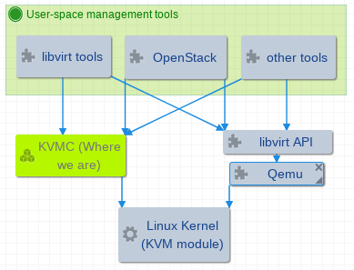

# QEMU-free KVM Client/Connector/Controller
User-space toolkit to manipulate and control KVM guests.

Virtualization is all about isolation and efficiency, and we try to eliminate QEMU blocks in the following diagram.

The objective is an efficient, developer friendly, production ready dynamic library, with bindings to different
languages(for platform integration). It should make use of VT-d enhanced device emulations, and probably a few
legacy ones in the meantime.

## Why are we
* KVM offers CPU virtualization only, and is not a full system virtualization solution, that's where QEMU finds its
  place. We are moving on to device virtualizaton for better performance, dependency on QEMU seems to be weaker.
    * Many of device virtualization tricks burst in to horizon, like IOMMU, SR-IOV, sPAPR, PCI-passthrough, VFIO, ...
    * A relatively simpler context allows device virtualization developers quickly apply their implementations
* Existing implementations, like QEMU/KVM, novm, kvmtool, have their limitations
    * As mainstream solution, QEMU endures relatively large codebase, most of which is unnecessary,
      under virtualization environment(CPU part is replaced by KVM, and device part is been replaced by
      evolving VT-d ones)
    * [QEMU-lite](https://github.com/01org/qemu-lite) is a working-on project that's smaller than full-functional
      QEMU at runtime, but won't reduce much of programmers' burden in the near future
    * [KVMTOOL](https://lwn.net/Articles/436781/) targets on been KVM functionality testing utility, and is not for
      production, moreover, it seems to have been abandoned
    * [NOVM](https://github.com/google/novm) targets on restricted hardware and use case(Google Cloud Platform),
      and most of all, it seems to be turned private
* Security is a not-so-important, and so important topic, larger codebase is likely to introduce more bugs

### From the original announcement email on KVMTOOL
The goal of this tool is to provide a clean, from-scratch, lightweight KVM host tool implementation that can boot
Linux guest images (just a hobby, won't be big and professional like QEMU) with no BIOS dependencies and with only
the minimal amount of legacy device emulation.

It's great as a learning tool if you want to get your feet wet in virtualization land: it's only 5 KLOC of clean
C code that can already boot a guest Linux image.

Right now it can boot a Linux image and provide you output via a serial console, over the host terminal, i.e. you
can use it to boot a guest Linux image in a terminal or over ssh and log into the guest without much guest or host
side setup work needed.

### Google's statement about their implementation for GCP
Non-QEMU implementation: Google does not use QEMU, the user-space virtual machine monitor and hardware emulation.
Instead, we wrote our own user-space virtual machine monitor that has the following security advantages over QEMU:

  Simple host and guest architecture support matrix. QEMU supports a large matrix of host and guest architectures,
  along with different modes and devices that significantly increase complexity. Because we support a single
  architecture and a relatively small number of devices, our emulator is much simpler. We don't currently support
  cross-architecture host/guest combinations, which helps avoid additional complexity and potential exploits.
  Google's virtual machine monitor is composed of individual components with a strong emphasis on simplicity and
  testability. Unit testing leads to fewer bugs in complex system. QEMU code lacks unit tests and has many
  interdependencies that would make unit testing extremely difficult.

No history of security problems. QEMU has a long track record of security bugs, such as VENOM, and it's unclear
what vulnerabilities may still be lurking in the code.

## References
* [Thread for original discussion on motivation of similiar project](http://thread.gmane.org/gmane.linux.kernel/962051/focus=962620)
* [Another detailed example in the lwn.net article](http://lwn.net/Articles/658511/)
* [7 ways we harden our KVM hypervisor at Google Cloud](https://cloudplatform.googleblog.com/2017/01/7-ways-we-harden-our-KVM-hypervisor-at-Google-Cloud-security-in-plaintext.html)
* https://news.ycombinator.com/item?id=13484926
* https://systems.cs.columbia.edu/projects/kvm-arm/
